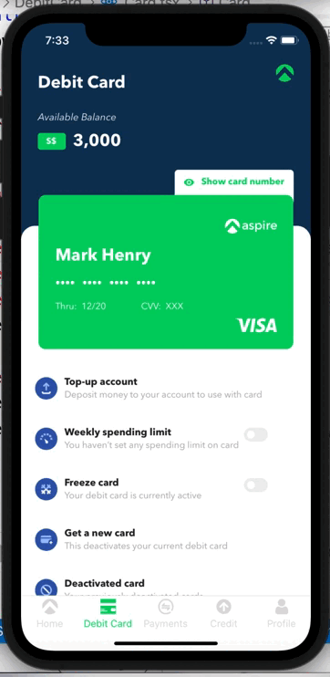
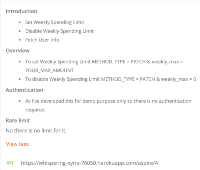
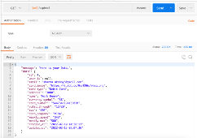
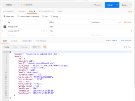

## AspireCards
AspireCards

### Dependencies

| **Dependency**      | **Use**                                              			|
| ------------------- | --------------------------------------------------------------  |
| Adonis JS           | A framework based on Node JS used to create API      			|
| clearDB MySQL       | A cloud based Database to store data.                			|
| Heroku              | Used to deploy APIs                                  			|
| typescript          | Used for developing screens & validating proptype    			|
| react-native        | Used ReactNative v0.67.2.                            			|
| react-redux         | Connects React components to Redux                   			|
| hooks               | Complete app is devloped using functional component. 			|
| lottie-react-native | Used to show loading effect while fetching data      			|
| redux-saga          | Async redux library                                  			|
| jest                | used to do unit testing of data                      			|
| axios               | used to networking related stuff like fetching data from APIs   |

### AdonisJS (A Node based Framework to develop API)

## API Introduction
    - Set Weekly Spending Limit
    - Disable Weekly Spending Limit
    - Fetch User Info

    **Overview**
        - To set Weekly Spending Limit METHOD_TYPE = PATCH & weekly_max = YOUR_MAX_AMOUNT
    To disable Weekly Spending Limit METHOD_TYPE = PATCH & weekly_max = 0 

    **Authentication**
        - As I've developed this for demo purpose only so there is no authentication required for now. 

    **Rate limit**
        - No there is no limit for it.  

**[My LinkedIn Profile](https://www.linkedin.com/in/akshay8feb/)**
